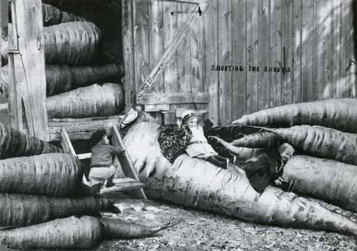
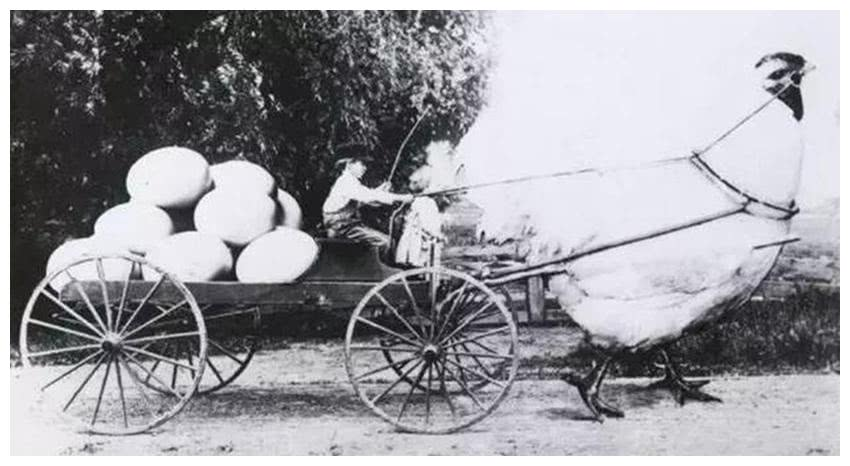
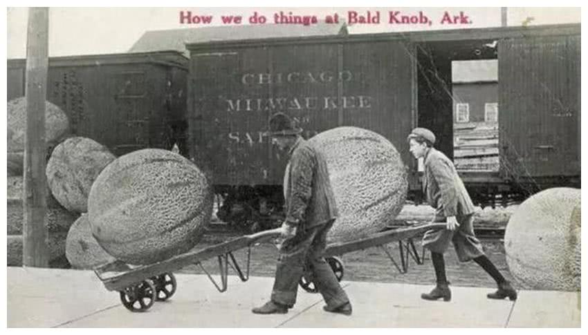
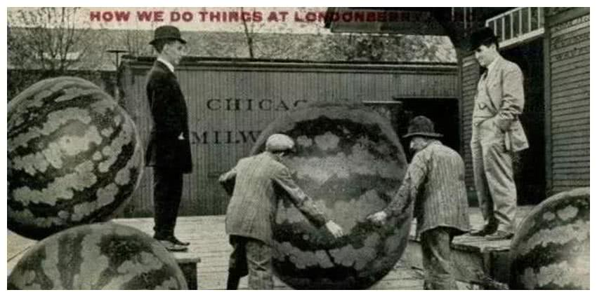
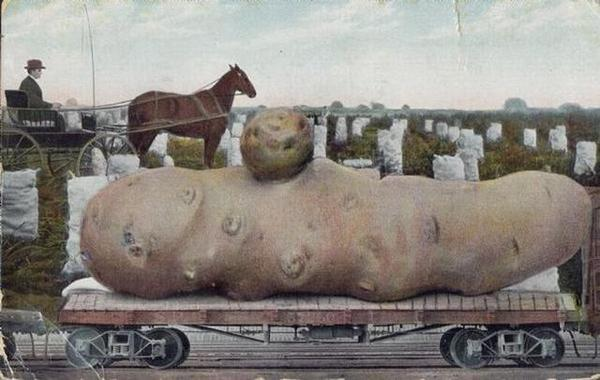
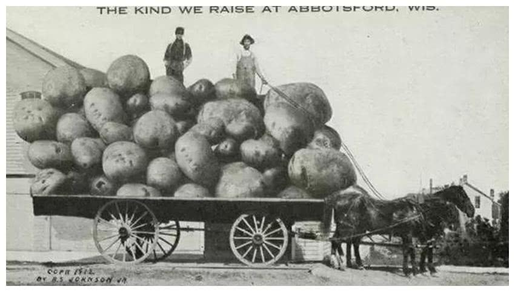

# 反辱华同盟手册
pdf 文件[*看这里*](latex/manual.pdf)

latex文件*[看这里](latex/manual.tex)*

## 1. 总章

中华反辱华同盟会是由拥有正义感的网友自愿组成的组织，是中国拥有正能量的网友的先锋队，同时是中国广大人民群众的先锋队。同盟会的目标是打倒一切辱华辱共团体和个人，彻底解决中国和中国共产党受到国内外不公正评价的问题。

中华反辱华同盟会以马克思列宁主义、毛泽东思想、邓小平理论、“三个代表”重要思想、科学发展观、习近平新时代中国特色社会主义思想作为自己的理论依据。

伟大领袖毛主席教导我们：“舆论的高地,你不去占领,敌人就会去占领。”为此，我们要积极主动地、勇敢地在网上发声，宣扬正能量，重新占领失去的舆论高地。

我们同盟会的全体会员要意识到，中国共产党虽然在历史上不可避免地犯过错误，其中有些错误甚至导致中国伤筋动骨，但是其中大部分错误已经被纠正。当前，中共的理论和主张是基本正确的，中国在中共的领导下正在正确的道路上高歌猛进，并已经取得了许多可喜可叹的伟大成果。

我们以“我好你烂”、“我烂你更烂”、“我过去烂现在不烂”、“我虽烂你也好不到哪去”的比较方法作为网络辩论基本方针。

现在，为了提高反辱华效率，特发放此手册每人一本。希望此手册能帮助各会员在未来工作斗争中发挥作用，为会员提供坚实的理论基础和辩驳材料。

## 2. 一些历史问题

### 2.1 外蒙独立问题

外蒙从中国独立并非是中共的所为。1924年蒙古人民共和国成立，宣布从中国独立。1945年8月14日，国民政府与前苏联签订《中苏友好同盟条约》，同意外蒙古根据公投结果独立。次年，也即民国三十五年（1946年）1月5日中国国民政府正式承认外蒙古从中华民国独立期间的一系列历史事件。1961年10月27日，联合国大会通过第1630号决议案，当时占据中国席位的台湾当局弃权，蒙古人民共和国加入联合国。

### 2.2 海参崴问题

1860年11月14日《中俄北京条约》将包括海参崴在内的乌苏里江以东地域割让给沙俄。1945年《中苏友好同盟条约》中并无关于海参崴50年后归还中国的条例（有的那个为网络讹传，无真实性）。不信去博物馆查！

2009年在海参崴发现了“万人坑”，如何能证明这不是被流放到这里的政治犯？

### 2.3 抗日“游而不击”问题

消灭人数不少。1945年5月，在重庆，国军宣布：国军经过八年英勇作战，消灭日本鬼子85万人，缴获日本鬼子枪支3万多支;同样在重庆，共军宣布:经过八年艰苦作战，消灭日本鬼子52万人，伪军100多万人，缴获长短枪68万2831支、轻重机枪1万1895挺、各种炮1852门。这个战报一出，全国哗然！

八路军消灭日本鬼子52万人缴获日本鬼子的武器足够装备几十万共军！怎么国军消灭日本鬼子85万人，缴获日本鬼子的武器只能够装备几万？各位，国军没缴获，你们还能想到是什么原因吗？

另，毛泽东：“第二次世界大战中我们是一个支队，不是主力军。”

人数增加问题：共军人数增加了110万，国军人数增加了300万！

### 2.4 大跃进问题

工业水平的确迅速提高，这是民国“黄金十年”所远不能相比的：钢铁产量跃升，粮食产量跃升，识字率跃升，甚至造了歼6，达到国际先进水平。

美国的浮夸风比中国更甚，延续时间比中国更长。

由于美国政府对农业生产过度乐观，其后产生了一系列政策上失误，牵连到了金融市场股票价格大跌，影响到工业大量工厂倒闭，连金库储存地银行也倒闭了一大批。此时，美国失去工作的工人市民还有农民，依然没有钱购买粮食的钱，随后出现了自然灾难农业生产再次遭受重创。新上任的罗斯福总统大量招收无业人员到各州搞基础设施，一月30美元工资州政府抽走25美元，留下了5美元给这些政府人员度日。（这抽血，够可以的了吧？）

美国人从重整农业开始，浮夸了十几年，产生了大量多余粮食。为了将粮食出售，采取毁掉扔掉的方法，试图太高粮食价格，天不如人意，随后出现的自然灾难使美国经济危机雪上加霜，导致种地者不得不以吃野草为生，政府救济处排满了等待救济的长队。（真·吃草）

有多少人死于这场大饥荒，美国政府至今没有公布，从已知的资料可知，1930-1931年美国人口增长是很快的，然后突然降了下了不动，直到10年后才恢复了之前人口水平，也就是说在十年里面大约有八百五十多万美国人口消失，而且，这些数据不包括非法移民，不包含没有政府登记人的死亡。虽然大饥荒时代已经过去了很久，美国政府无论谁上台均对其相关数据遮遮掩掩认为微不住道，外界更无从查起当时真实情况。

参看网址：http://m.kdnet.net/share-13112041.html\\

### 2.5 土地革命问题

对方经典论述：地主是中国农村最勤奋的农民，最具经济头脑的庄稼人，可就因为他们比别的人勤劳、节俭，省吃俭用多买了几亩地，多养了几头牲畜，他们就受到镇压、被批斗、被杀、有的甚至被灭门……他们的后代更是受尽屈辱 土改中被杀掉的二百万地主必须有个说法，用老毕的话说，地主遭谁惹谁了？

答：原来您家祖上是有田地的、剥削人的大地主。真对不起，我家是贫农，就是要打倒您。

### 2.6 三年自然灾害问题

- 没死那么多人

  根据CIA的报告：[https://www.cia.gov/library/readingroom/docs/DOC\_0001098172.pdf](https://www.cia.gov/library/readingroom/docs/DOC\_0001098172.pdf ) 和 [https://www.cia.gov/library/readingroom/docs/DOC\_0001098211.pdf]( https://www.cia.gov/library/readingroom/docs/DOC\_0001098211.pdf)

  ​    1961年的报告中有句子：Widespread famine does not appear to be at hand, but in some provinces many people are now on a bare subsistence diet and the bitterest suffering lies immediately ahead in the period before the June harvests.

  ​    翻译成中文：

  ​    当前似乎尚未发生普遍的饥荒，但在一些省份，许多人现在只能勉强维持生计，最痛苦的苦难就在6月收割之前的那段时期。

  ​    1962年的报告中有句子：The improved transportation facilities and the more effective control which the regime had developed over the past decade or so have made it possible to spread the suffering so that, although all (except a favored few) are underfed, there has been no localized mass starvation of the sort traditional in China.

  ​    过去十多年来，交通设施的改善和政权更有效的控制，使苦难得以蔓延，因此，尽管所有人(除了少数人)都吃不饱饭，但在中国没有发生传统的那种局部的大规模饥荒。

  ​    （因此3000万是子虚乌有的事情）

- 美国大萧条时期饿死的人比率更高，美国上世纪30年代大饥荒饿死人数据何时公开？

  美国自立国起每十年一次人口普查，应该很有经验和准确。我们做以下统计和比较

  ​    就可以得知美国人口在各年份增长的情况：

  ​    1900～1910年，增加1601万人；

  ​    1910～1920 年，增加1380万人；

  ​    1920～1930年，增加1700万人；

  ​    1930～1940年，增加 896万人；

  ​    1940～1950 年，增加1916万人；

  ​    1950～1960年，增加21000万人。

  ​    我们可以看出，在从1900年～1960年期间，美国平均以 1700万人(每十年)的速度增长，但在1930年～1940年出现了异常情况，人口仅增长了不到900万人，比正常情况减少1000多万人。而1930 年～1933年美国暴发严重的经济危机，发生了遍及全美国的大饥荒和普遍的营养不良，导致大量人口非正常死亡。最保守的估计，至少有1000万人以上被饿死，约占当时美国总人口的$9\%$以上。

  ​    美国大饥荒饿死人惨状

  ​    1932年这年是最黑暗的一年，当年10月，即大选前一个月，纽约市卫生局报告说：公立学校的小学生有$50\%$的学生营养不良。美国友谊服务委员会的秘书对国会一个委员会说，在俄亥俄、西弗吉 尼亚、伊利诺伊、肯塔基和宾夕法尼亚各州的矿区，营养不良的儿童有时达总数$90\%$以上，他们的症状是“思睡、发懒、困倦、智力发展受阻”。

  ​    可是就在这种情况下，胡佛总统仍对记者们说：“我们美国根本就没有谁真正挨饿。拿那些流浪汉来说，他们吃的就比过去什么时候都好。纽约有一个流浪汉，一天吃了十顿饭。”

- 整个民国期间人口不变，换算下来死亡更高

### 2.7 文革问题

### 2.8 六四问题

## 3. 一些经济问题

### 3.1 国企垄断问题

### 3.2 香港衰落问题

### 3.3 一带一路和对外投资问题

### 3.4 中俄友好问题

### 3.5 共产主义的“剥削”和生产资料所有问题

### 3.6 “割韭菜”问题

## 4. 一些文化问题

### 4.1 “支那”问题

你这么瞧不起我，所以我不支持您。中共还把我当人看，所以我支持他们。

### 4.2 “黄俄”问题

解放战争前，民国政府接受的苏联援助远比中共多。（此处有资料可依）

《中苏友好互助条约》是无产阶级同志的帮助，中国没有出卖国家主权和利益。不似蒋介石舔狗，承诺反攻大陆后连本带利还西方贷款。

### 4.3 “洗脑”问题

会员：那您的意思是，他们说的都是错的，只有您说的才是真相？

反：那是自然。

会员：真巧，他们也是这么说的。

### 4.4 “让人民吃草”问题

对方经典陈述：当今“共匪”又在叫嚣“吃草共渡难关”

请拿出出处以给出您说此话的依据。

（事实上，这句话是时由郭文贵“爆料”的。据他“爆料”，任中国国家副主席王岐山在与美国进行贸易谈判时，面对“美国人可以过没有中国货的日子”时，曾表态“中国老百姓吃草也可以过一年”。这句话有三点漏洞：零、这是来源于郭文贵的“爆料”，其可信度之低世人皆知；一、与美方谈判时，王岐山没做过领头的；二、即使中美完全断绝贸易关系，中国也不会落入“只吃草”的境地。双方都是聪明人，都知道对方的谈判目标，不可能互做这种奥无意义、纯属浪费时间的表态。反共人士也知道这一点，故他们不可能举得出来“让人民吃草”的来源。因此这句话将不攻自破。）

### 4.5 中共党史不可靠问题

### 4.6 火葬问题

## 5. 一些当代问题

### 5.1 庆丰包子铺问题

没问题。奥巴马还给Cheesecake Factory蛋糕店打广告呢，国家主席给老字号打广告有什么问题？

### 5.2 小熊维尼“被禁”问题

没有。自己查百度。

### 5.3 “十里山路不换肩”问题

### 5.4 法国发言稿的问题

### 5.5 学历问题

英雄不问出身。国民政府在重庆时，政府高官几乎全是美国博士。但是《时代》周刊特派记者白修德曾曾说：“这个政府中说得一口流利英语的所有高官都与自己国家的人民严重脱节，他们不了解自己的国民，甚至都不了解脚下的这座古城，因此根本无法帮助我了解中国真正的现状。除了蒋介石以外，这批人无论生活、做梦、思考、交流用的都是英语。”最终也就无法收获民众的支持，导致国民党政权在大陆的溃败。

习近平是法学博士，比小布什的大学肄业还是高一点的吧？你说造假，论文都在网上公开下载。

## 6. 一些军事问题

### 6.1 武统台湾问题

听说这次绕台，台军一架飞机都没起来？

### 6.2 歼10自主权问题

### 6.3 歼20自主权问题

### 6.4 辽宁号作战意义问题

冒烟的是库兹涅佐夫号。

### 6.5 一些其他共产主义国家的问题

对方经典陈述：苏联掩盖乌克兰民族灭绝真相，共产党用大饥荒残害饿死人民

答：苏联时期，乌克兰没有自己独立的“乌克兰族”，只有西乌克兰的波兰族和东乌克兰的俄罗斯族。乌克兰的哥萨克骑兵是沙俄最有利的骑兵军队。因此显然不存在“民族屠杀”问题。

饥荒世界各地都有。